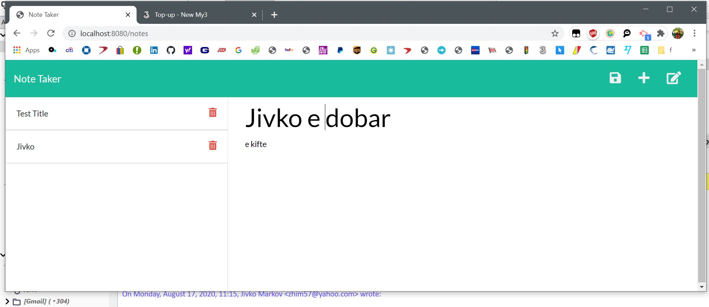
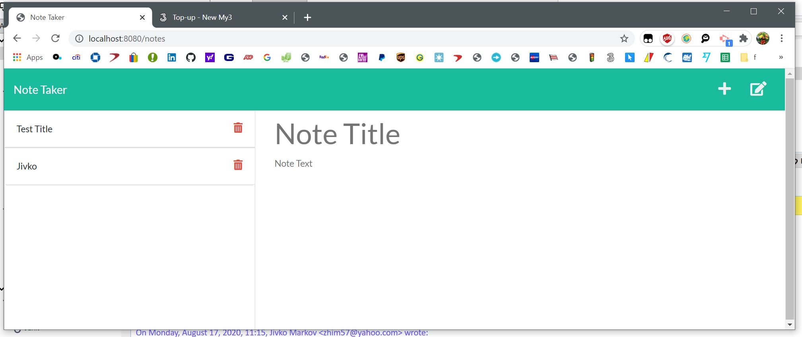

# Title : note-taker

## Description
Author: Jivko Atanassov

This is an application for taking notes, it uses a database file to store them as arrays and get ,post, put and delete requests to manipulate the individual notes.

Github User name: zhim57

## Table of Contents:
- [Title](#title)
- [Description](#description)
- [Table of Contents](#table-of-contents)
- [Installation](#installation)
- [Usage](#usage)
- [License](#licence)
- [Contributing](#contributing)
- [Tests](#tests)
- [Questions](#questions)

## Installation
The user has to do an" npm init", "npm add express path" and "node server" from the directory where server.js is located. 
## Usage
- Web development/front end
- Node.js  application
- Web development back end
- Database Application
- Productivity Application
this is a great solution for people that need to take notes but have something preventing them from taking another way. Fot example if the person has a fobia for pens or pensils and other computer or mobile apps , this one will be litterally a life saver for such a person.
## Email
zhim57@yahoo.com
## Contributing
none
## License

## Tests
extensive usage test

## Questions
please email Jivko Atanassov with any questions at: zhim57@yahoo.com. Thank You.

## Links

[link to this portfolio](https://github.com/zhim57/note-taker)

[link to the deployed application](heroku)
  

## Screenshots

  